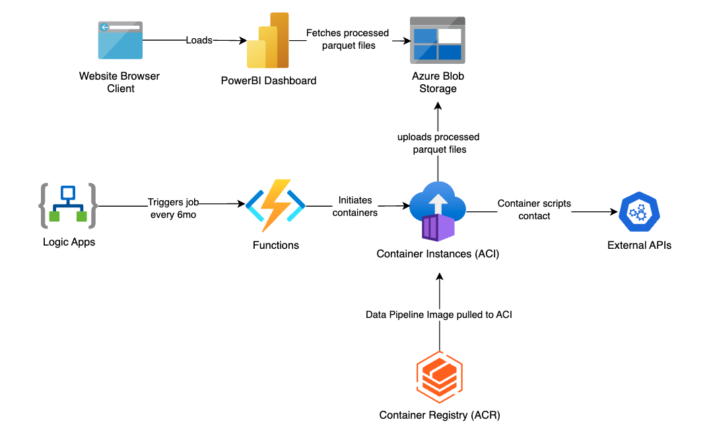
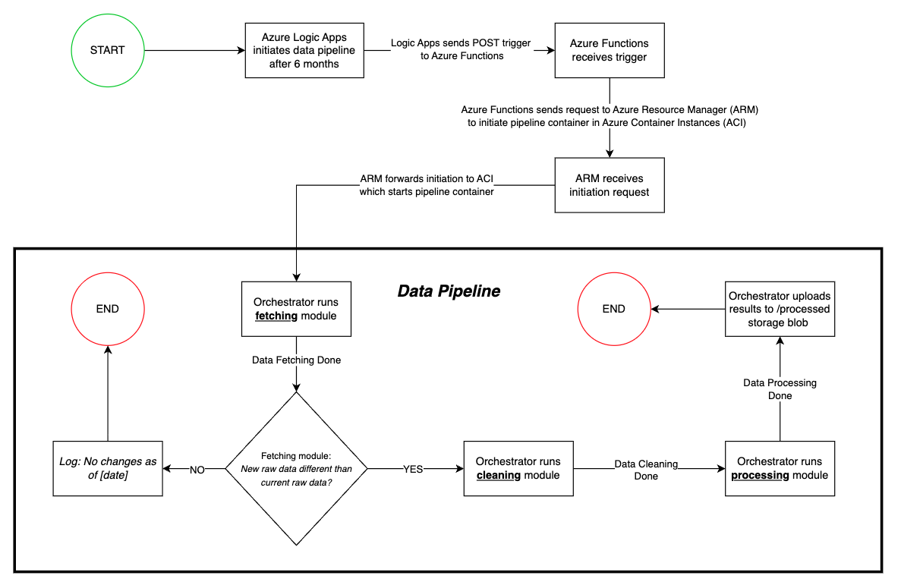

# PlanCatalyst Data Dashboard

## What This Project Is

This is an interactive dasbhoard that visualizes country-level development.
It helps PlanCatalyst teams and stakeholders identify where need is highest and where investments can
have the most practical impact.

This repository contains the full data platform behind that dashboard:

- ingestion from external data sources
- cleaning and transformation logic
- scoring and aggregation across the 7-pillar model
- automated cloud publishing for the dashboard experience

Organizations often have fragmented datasets across health, agriculture, climate,
infrastructure, and socio-economic indicators. This project turns that fragmented
data into one reliable, comparable, country-level view that can be explored by
non-technical users in the dashboard.

## What We Built

- **A repeatable data pipeline** that fetches, cleans, and scores indicator data
  from multiple global sources.
- **A cloud publishing workflow** on Azure that pushes processed outputs for the
  dashboard to consume.
- **A frontend-ready data layer** that allows the React dashboard (embedded in
  Wix) to load consistent, versioned data snapshots.
- **An operational model** with validation and guardrails so bad runs do not
  overwrite known-good outputs.

## Architecture Overview

The system is built as an automated Azure flow: scheduled trigger -> function
orchestration -> containerized pipeline -> blob publishing -> dashboard load.

## Data Flow

At a high level, the pipeline runs on a schedule, checks for new upstream data,
then processes and publishes only when updates exist.

## Platform and Stack

- **Cloud:** Azure Blob Storage, Azure Functions, Azure Container Instances,
Azure Container Registry, Logic Apps
- **Backend:** Python data pipeline
- **Frontend:** React dashboard embedded in Wix
- **Data sources:** UN SDG, World Bank, ND-GAIN, UNDP Human Development Reports (HDI/GII/MPI), World Bank Worldwide Governance Indicators (WGI), and additional indexed sources

## Team

This project is built by the Tehos Organization at Western University.

- **Project Managers:**
  - **Thomas Llamzon**: Project architecture + data pipeline
  - **Anthony Lam**: Cloud design + automation
- **Developers:**
  - **Adeline Lue Sang**: Frontend design + backend integration
  - **Christina Wong**: Backend integration
  - **Tyler Asai**: Data cleaning + data pipeline
  - **Caroline Shen**: Data fetching + error handling
  - **Kayden Jaffer**: Projections research

## Documentation

- `HANDOFF.md` - project context and implementation history
- `TEAM-TASKS.md` - current execution plan and ownership
- `docs/PRINCIPLES.md` - project mission and operating constraints
- `docs/data-contract.md` - technical backend/frontend payload specification
- `indicators/indicators.yaml` - indicator taxonomy and metadata
- `indicators/SCORING_AUDIT.md` - scoring-direction audit and current gaps

