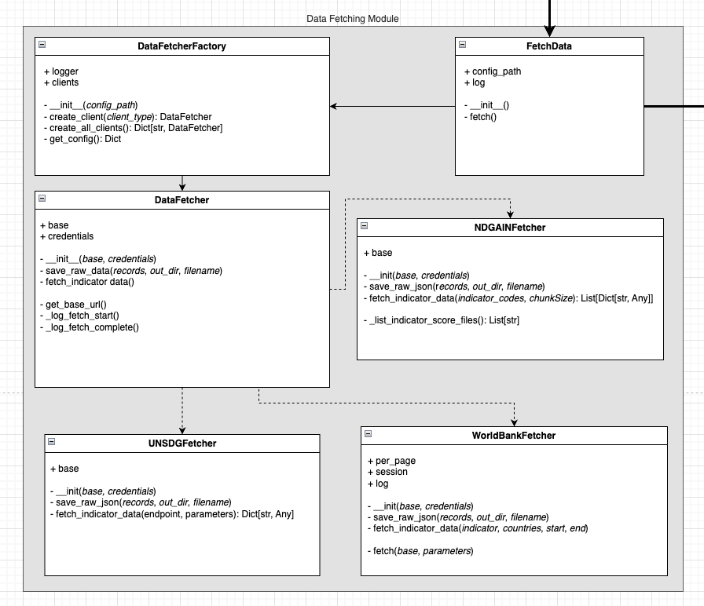

# Data Fetching Module
These scripts fetch data from UN SDG, World Bank API, ND-GAIN, UNDP HDR, and World Bank Worldwide Governance Indicators (WGI).

## Module Information

## Overview
This module is responsible for fetching the raw data from five fetching clients:

| Source key | Class | Transport |
|---|---|---|
| `unsdg` | `UNSDGFetcher` | UN SDG REST API |
| `worldbank` | `WorldBankFetcher` | World Bank REST API |
| `ndgain` | `NDGAINFetcher` | local bulk ZIP (`data/raw/nd-gain/`) |
| `undp_hdr` | `UNDPHDRFetcher` | per-release static CSV/XLSX over HTTPS |
| `wb_wgi` | `WBWGIFetcher` | per-release static XLSX over HTTPS |

Each `DataFetcher` client gathers a payload of indicator data records, and structures it appropriately for the corresponding `DataCleaner` object to clean. The raw data is passed by variable, and is NOT persisted to disk by default (set `runtime.save_raw: true` to also write it out for debugging).

## Running this Module
To run the fetching module, refer to the [pipeline README](../pipeline/README.md).

## Module Architecture

This module implements the abstract factory pattern to create the appropriate cleaner objects based on the source of the data, as well as to allow for easy extension of the module to support additional data sources in the future.

## About the Sources
### United Nations Sustainable Development Goals (UN SGDs)
The SDG framework measures global development through a hierarchy of:
- 17 Goals – Broad global development objectives 
- 169 Targets – Measurable sub-objectives under each goal
- ~250+ Indicators – Numerical metrics used to assess progress toward a target
- Series – Statistical definitions used to publish values for an indicator

__Indicators__ are the concepts being measured and series are the actual numeric data published for each indicator. These series form year-by-year development time series for every country, covering health, education, poverty, sustainability, infrastructure, and governance.

The `UNSDGClient` currently gathers a specific set of 22 indicators (can be found in `/src/config/settings.yaml`) from the UN SDGs public API V5: https://unstats.un.org/sdgs/UNSDGAPIV5/v1/sdg. It uses only the indicator data endpoint: `/Indicator/Data`, which returns a specified country's observation value of a specific development indicator for all years within the specified time range.

**Indicators with multiple identical rows (dimension-based fetch):** Some indicators (e.g. 3.d.1 IHR capacity) return many rows per (country, year) that only differ by value; the API populates the distinguishing dimension (e.g. "IHR Capacity") correctly only when the request includes a dimension filter. For such indicators, the pipeline fetches them **per dimension value** (one request per class) and merges the results. This is configured in `/src/config/unsdg_indicator_classes.yaml`: set `fetch_by_dimension: true` and provide `dimension_field` and `classes` (keys = dimension values). The fetcher then calls `/Indicator/Data` once per dimension value and concatenates the records so the cleaner can assign `class_code` / `class_name` from the API response.

### Notre Dame Global Adaptation Index (ND-GAIN)
We are currently using the ZIP file from the ND-GAIN [bulk download page](https://gain.nd.edu/our-work/country-index/download-data/) on their website. This is the only viable, and most up-to-date data source we can currently find.

The `resources/indicators/` folder contains all raw ND-GAIN climate indicators. These indicators are the inputs used to build the ND-GAIN Vulnerability Index, Readiness Index, and overall ND-GAIN score. Each indicator is defined in the ND-GAIN Country Index Codebook (`/data/external/ND_GAIN Country Index Codebook.pdf`).

ND-GAIN indicators quantify how climate change affects a country across __six vulnerability sectors__ to make __the ND-GAIN Vulnerability Index__:
1. Food (`id_food_X`)
2. Water (`id_wate_X`)
3. Health (`id_heal_X`)
4. Ecosystem Services (`id_ecos_X`)
5. Human Habitat (`id_habi_X`)
6. Infrastructure (`id_infr_X`)

Each sector contains _six_ indicators where each indicator measures a specific climate exposure, sensitivity, or capacity (e.g., projected cereal yield change, freshwater withdrawal rate, flood hazard, medical staff, etc.). Additional indicators exist the __three Readiness sectors__ (economic, governance, social). A __sector score__ is the mean of its six indicators for a specific country—a single number that summarizes a country’s vulnerability in that domain. Sector scores only have meaning per country, since they’re derived from country-specific indicator data. All sector scores are required to compute _the Vulnerability Index_. Readiness indicators help compute _the Readiness Index_.

We use all raw indicators in resources/indicators/ because they:
* Represent the fundamental climate-risk variables per country
* Allow construction of sector scores, vulnerability, readiness, and custom indices
* Create interpretable measures for cross-country comparison
* Enable time-series modeling and forecasting once combined with UN SDG/World Bank data

These composites give the dashboard meaningful, policy-relevant climate development metrics that can be tracked and forecasted over time.

### UNDP Human Development Reports (HDR)
The UNDP HDR data center publishes per-release static files containing the Human Development Index family (HDI, GII, IHDI, GDI, PHDI) plus a separate Global Multidimensional Poverty Index (MPI) table assembled with OPHI. We currently use:

- **2025 HDR composite-indices CSV** (`HDR25_Composite_indices_complete_time_series.csv`) — wide-format CSV with year-suffix columns (`gii_1990` … `gii_2023`). Source of the `GII_INDEX` series. Latin-1 encoded.
- **2025 Global MPI Tables XLSX** (`2025_gMPI_Table1and2.xlsx`) — OPHI-style multi-sheet workbook. Table 2 carries changes-over-time per country with one row per (country, survey wave). Source of the `MPI_INDEX` series.

The `UNDPHDRFetcher` downloads each configured file by URL into `data/raw/undp-hdr/<alias>.<ext>` and writes a manifest JSON describing what landed. The cleaner picks the right indicator columns / sheet per series_code. Adding another HDR indicator (e.g. HDI) is a config-only change in `settings.yaml` — just add another file entry or another `indicators:` row under an existing file.

### World Bank Worldwide Governance Indicators (WGI)
WGI was deprecated from the regular World Bank API in 2024 and is now published as a per-release bulk XLSX on the WGI homepage. We use:

- **WGI 2025 release** (`wgidataset_with_sourcedata-2025.xlsx`) — 1996–2024 panel for 214 economies, with six dimensions on six sheets (`va`, `pv`, `ge`, `rq`, `rl`, `cc`). Each sheet ships a pre-normalized 0-100 "Governance score" column we consume directly.

Today we use only the Government Effectiveness sheet (`ge`) as our state-capacity proxy → `WGI_GOVEFF`. To add another WGI dimension, add an entry under `wb_wgi.files[*].indicators` in `settings.yaml`.

### World Bank Group
The World Bank publishes one of the __largest collections of global development, economic, demographic, and environmental time-series__. Each metric is defined as an indicator (e.g., GDP per capita, CO₂ emissions, school enrollment), and nearly all indicators provide annual values by country, often spanning decades.

Our WorldBankClient retrieves a configurable set of indicators (defined in `/src/config/settings.yaml`) using the World Bank’s `/country/{codes}/indicator/{id}` endpoint. For each indicator, the API returns:

- annual numeric observations
- the year
- simple metadata (source, units, etc.)

These indicators fill the __economic and demographic__ layer of the project. They provide reliable long-term signals such as population growth, economic productivity, trade, emissions, and resource use.

We use World Bank data because it:

- Supplies stable __long-horizon time series__ needed for regression and forecasting
- Complements SDG social metrics and ND-GAIN climate metrics
- Supports building __composite indexes__ that combine economic, social, and climate dimensions
- Enables interpretable country-level comparisons grounded in widely trusted, standardized data

In short, World Bank indicators give us the economic and demographic backbone required for robust modeling, forecasting, and index construction.
